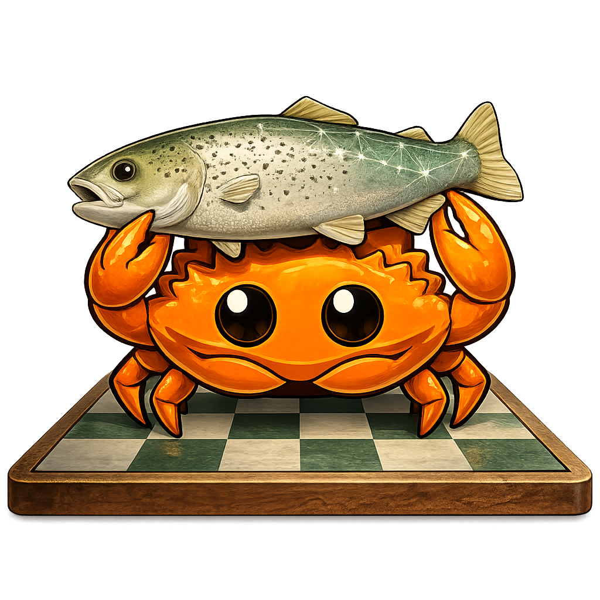

# Ironfish

<div align="left">

[]()
[](https://www.rust-lang.org)
[](LICENSE)
[]()
[]()
[](https://github.com/HEKPYTO/IRONFISH/actions/workflows/ci.yml)

</div>

<div align="center">
  
</div>

Ironfish is a **fault-tolerant, distributed chess analysis engine** built with Rust. It serves as a powerful backend for chess applications, allowing you to offload heavy analysis tasks to a scalable cluster of workers.

Whether you are a developer building a chess GUI, a researcher analyzing games, or an enthusiast wanting to run your own analysis server, Ironfish provides a robust, self-healing platform.

## Why Ironfish?

- **Flexible Deployment:** Run it as a **single node** for personal use or scale out to a **distributed cluster** for enterprise-grade performance.
- **Resilient:** Built-in fault tolerance means if a node crashes, the cluster recovers automatically without losing your analysis requests.
- **API First:** Exposes your choice of **REST**, **gRPC**, or **GraphQL** APIs on a single port (8080).
- **Secure:** Token-based authentication ensures only authorized clients can submit expensive analysis jobs.
- **Observable:** Real-time metrics endpoint for monitoring CPU, memory, and engine load.

## Architecture Overview

Ironfish operates on a peer-to-peer architecture using a **Gossip Protocol** for membership and state sharing.

1.  **API Layer:** Handles incoming requests (REST / gRPC / GraphQL) and authenticates users.
2.  **Cluster Service:** Manages node discovery, failure detection, and leader election (Hybrid Raft/Bully algorithm).
3.  **Load Balancer:** Smartly routes analysis requests to the least loaded node in the cluster.
4.  **Stockfish Pool:** Manages a local pool of Stockfish engine processes to execute the actual chess analysis.

---


## Getting Started

You can run Ironfish in two modes: **Single Node** (Standalone) or **Cluster Mode**.

### Prerequisites
*   **Docker & Docker Compose** (Recommended for easiest setup)
*   *Alternatively:* Rust toolchain (cargo) and Stockfish binary installed locally.

### Mode 1: Single Node (Standalone)
Ideal for local development or personal use.

```bash
# Start a single Ironfish node
docker run -d -p 8080:8080 --name ironfish \
  -e IRONFISH_ADMIN_KEY="secret-admin-key" \
  ghcr.io/hekpyto/ironfish:latest
```

Your server is now ready at `http://localhost:8080`

### Mode 2: Distributed Cluster
Ideal for high-availability and parallel processing.

1.  **Clone the repo:**
    ```bash
    git clone https://github.com/HEKPYTO/IRONFISH.git
    cd IRONFISH
    ```

2.  **Start the cluster:**
    ```bash
    docker compose up -d
    ```
    This spins up 3 nodes (`node1`, `node2`, `node3`) that automatically discover each other.

---


## Authentication & Usage

Ironfish is secure by default. You need an **Admin Key** to manage tokens and an **API Token** to perform analysis.

### 1. Create an API Token
Use your Admin Key (defined in env vars) to generate a token for your application.

```bash
curl -X POST http://localhost:8080/_admin/tokens \
  -H "X-Admin-Key: cluster-admin-secret" \
  -H "Content-Type: application/json" \
  -d '{"name": "my-chess-app"}'
```
**Response:**
```json
{
  "id": "...",
  "token": "iff_abc123...",
  "expires_at": null
}
```

### 2. Analyze a Position
Use the generated `token` to submit a chess position (FEN) for analysis.

```bash
curl -X POST http://localhost:8080/v1/analyze \
  -H "Authorization: Bearer iff_abc123..." \
  -H "Content-Type: application/json" \
  -d 
    "{
      \"fen\": \"rnbqkbnr/pppppppp/8/8/8/8/PPPPPPPP/RNBQKBNR w KQkq - 0 1\",
      \"depth\": 20
    }"
```

---


## API Reference

| Method | Endpoint | Description | Auth Required |
| :--- | :--- | :--- | :--- |
| `GET` | `/v1/health` | Check node health status |  No |
| `GET` | `/v1/metrics` | Real-time system & cluster metrics |  Bearer Token |
| `POST` | `/v1/analyze` | Submit analysis job (JSON) |  Bearer Token |
| `POST` | `/v1/bestmove` | Submit fast best move job (JSON) |  Bearer Token |
| `WS` | `/v1/ws` | WebSocket connection for real-time analysis |  Bearer Token |
| `POST` | `/graphql` | GraphQL Query/Mutation endpoint |  Bearer Token |
| `POST` | `/_admin/tokens` | Create a new API token |  Admin Key |
| `DELETE` | `/_admin/tokens/:id` | Revoke an existing token |  Admin Key |

---


## Development

### Pre-commit Hooks
We use `husky` to ensure code quality. The pre-commit hook runs `cargo fmt` and `cargo clippy` automatically.

```bash
# The hooks are configured to use the local .husky directory
# Ensure the script is executable
chmod +x .husky/pre-commit
```

### Running Tests
To run the full test suite, including integration tests:
```bash
cargo test --workspace
```
*Note: Docker integration tests run sequentially to avoid port conflicts.*

## License
MIT